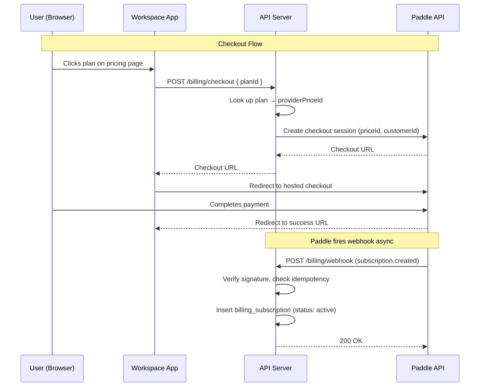
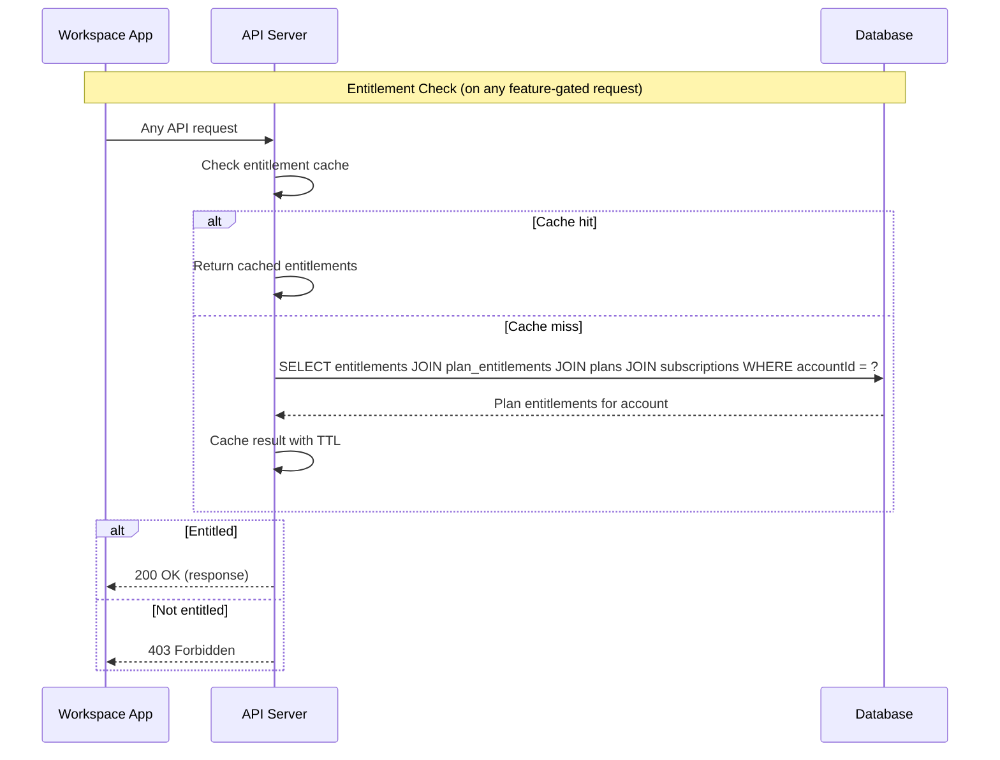

# Billing Architecture

## Components
- Billing API: owns customer creation, checkout sessions, portal link generation.
- Webhook Receiver: validates and processes provider events.
- Entitlement Service: resolves feature access per account.
- UI Surfaces: pricing, checkout, billing settings.

## Data Flow
1. User initiates checkout from pricing page.
2. Billing API creates provider checkout session.
3. Provider redirects back to product; subscription created.
4. Webhook updates subscription status.
5. API and UI derive entitlements from account → subscription → plan → plan entitlements.

## Integration Points
- Auth/Accounts: map billing customers to internal accounts.
- Feature gating: API middleware and frontend guard hooks.

## Checkout Flow

## Subscription Lifecycle Webhooks

All subscription state changes originate from Paddle. Every event is logged to `billing_events` for idempotency and audit, then the subscription row is updated and the entitlement cache is invalidated.

```mermaid
sequenceDiagram
    participant Paddle as Paddle
    participant API as API Server
    participant DB as Database

    Note over Paddle,DB: Subscription Lifecycle Webhooks

    rect rgb(30, 30, 30)
    Note right of Paddle: Payment succeeds
    Paddle->>API: subscription.created / subscription.updated
    API->>API: Verify signature
    API->>DB: INSERT billing_event (idempotency check)
    API->>DB: UPSERT billing_subscription (status: active)
    API->>API: Invalidate entitlement cache
    API-->>Paddle: 200 OK
    end

    rect rgb(30, 30, 30)
    Note right of Paddle: Payment fails
    Paddle->>API: transaction.payment_failed
    API->>DB: INSERT billing_event
    API->>DB: UPDATE billing_subscription (status: past_due)
    API->>API: Invalidate entitlement cache
    API-->>Paddle: 200 OK
    end

    rect rgb(30, 30, 30)
    Note right of Paddle: User cancels
    Paddle->>API: subscription.canceled
    API->>DB: INSERT billing_event
    API->>DB: UPDATE billing_subscription (status: canceled)
    API->>API: Invalidate entitlement cache
    API-->>Paddle: 200 OK
    end
```

## Entitlement Check Flow

Entitlements are derived at query time via the join chain `account → subscription → plan → plan_entitlements`, cached in-process with a TTL, and invalidated on webhook events.

